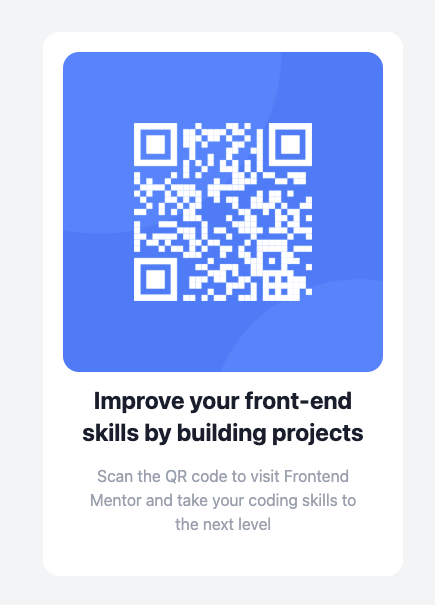

# Frontend Mentor - QR code component solution

This is a solution to my [QR code component challenge on Frontend Mentor](https://www.frontendmentor.io/challenges/qr-code-component-iux_sIO_H). Frontend Mentor challenges help me improve my coding skills by building realistic projects. 

## Table of contents

- [Overview](#overview)
  - [Screenshot](#screenshot)
  - [Links](#links)
- [My process](#my-process)
  - [Built with](#built-with)
  - [What I learned](#what-i-learned)
  - [Continued development](#continued-development)
  - [Useful resources](#useful-resources)
- [Author](#author)
- [Acknowledgments](#acknowledgments)

## Overview

### Screenshot




### Links

- Solution URL: [Add solution URL here](https://github.com/Melodyysol/tailwind-project)
- Live Site URL: [Add live site URL here](https://melodyysol.github.io/tailwind-project/)

## My process

### Built with

- Semantic HTML5 markup
- CSS custom properties
- Flexbox
- CSS Grid
- Mobile-first workflow
- [Tailwind](https://tailwindcss.org/) - CSS library

### What I learned
I learnt how to use Tailwindcss, I understood that we write HTML in a particular file, and style there also, which I was a little bit worry, and later understood how cool, easier and faster it is.


```html
  <h1 class="text-2xl font-bold text-gray-900">
    <p>Improve your front-end</p> <p>skills by building projects</p>
  </h1>
```

### Continued development

I wish I could work with real projects using tailwindcss. I also will continue to read and solve more complex problem using tailwindcss

### Useful resources

- [Tailwind Doc](https://tailwindcss.com/docs/styling-with-utility-classes) - Makes me check the short form of style, and what its being used for.

## Author

- Website - [Issa Abdulwaris Atere](https://github.com/Melodyysol/)
- Frontend Mentor - [@Melodyysol](https://www.frontendmentor.io/profile/yourusername)
- Twitter - [@Melody_Shiller](https://www.twitter.com/yourusername)

## Acknowledgments

First of all, I thank my parents, May Allah bless them. I appreciate Frontend Mentor for providing this challenge. Also I appreciate the effort of my mentors, who have always be with me from the start of learning this skill
